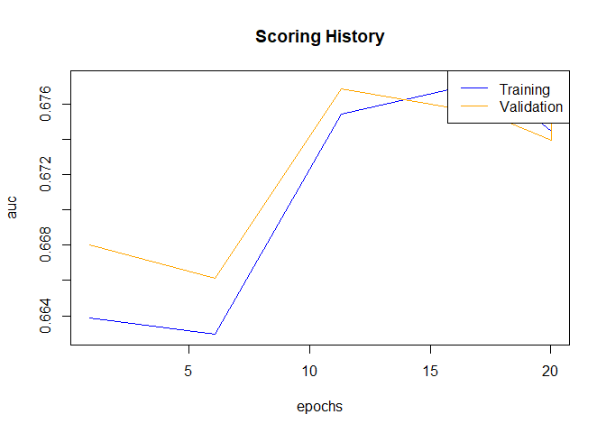

H2O Algorithms
================

``` r
h2o.describe(data)
```

    ##                    Label Type Missing  Zeros PosInf NegInf     Min
    ## 1              loan_amnt  int       0      0      0      0  500.00
    ## 2                   term enum       0 129950      0      0    0.00
    ## 3               int_rate real       0      0      0      0    5.42
    ## 4             emp_length  int    5804  14248      0      0    0.00
    ## 5         home_ownership enum       0      1      0      0    0.00
    ## 6             annual_inc real       4      0      0      0 1896.00
    ## 7                purpose enum       0   2842      0      0    0.00
    ## 8             addr_state enum       0    413      0      0    0.00
    ## 9                    dti real       0    270      0      0    0.00
    ## 10           delinq_2yrs  int      29 139459      0      0    0.00
    ## 11            revol_util real     193   1562      0      0    0.00
    ## 12             total_acc  int      29      0      0      0    1.00
    ## 13              bad_loan  int       0 133971      0      0    0.00
    ## 14 longest_credit_length  int      29     11      0      0    0.00
    ## 15   verification_status enum       0  59155      0      0    0.00
    ##           Max         Mean        Sigma Cardinality
    ## 1    35000.00 1.307417e+04 7.993556e+03          NA
    ## 2        1.00 2.075591e-01 4.055605e-01           2
    ## 3       26.06 1.371590e+01 4.391940e+00          NA
    ## 4       10.00 5.684353e+00 3.610664e+00          NA
    ## 5        5.00           NA           NA           6
    ## 6  7141778.00 7.191567e+04 5.907092e+04          NA
    ## 7       13.00           NA           NA          14
    ## 8       49.00           NA           NA          50
    ## 9       39.99 1.588153e+01 7.587668e+00          NA
    ## 10      29.00 2.273570e-01 6.941679e-01          NA
    ## 11     150.70 5.407917e+01 2.528537e+01          NA
    ## 12     118.00 2.457973e+01 1.168519e+01          NA
    ## 13       1.00 1.830389e-01 3.866996e-01          NA
    ## 14      65.00 1.485427e+01 6.947733e+00          NA
    ## 15       1.00 6.392702e-01 4.802137e-01           2

``` r
# Since we want to train a binary classification model, 
# we must ensure that the response is coded as a factor
# If the response is 0/1, H2O will assume it's numeric,
# which means that H2O will train a regression model instead

data$bad_loan <- as.factor(data$bad_loan)  #encode the binary repsonse as a factor
h2o.levels(data$bad_loan)

splits <- h2o.splitFrame(data = data,
                         ratios = c(0.7, 0.15), # Partition Data into 70%, 15%, 15% chunks
                         seed = 1)
train <- splits[[1]]
valid <- splits[[2]]
test <- splits[[3]]

nrow(train)
nrow(valid)
nrow(test)

# Identity response and predictor variables
y <- "bad_loan"
x <- setdiff(names(data), c(y, "int_rate"))  #remove the interest rate column because it's correlated with the outcome

# Now that we have prepared the data, we can train some models
# We will start by training a single model from each of the H2O supervised algos:
# 1. Generalized Linear Model (GLM)
# 2. Random Forest (RF)
# 3. Gradient Boosting Machine (GBM)
# 4. Deep Learning (DL)
# 5. Naive Bayes (NB)

# 1. Let's start with a basic binomial Generalized Linear Model
# By default, h2o.glm uses a regularized, elastic net model
glm_fit1 <- h2o.glm(x = x, 
                    y = y, 
                    training_frame = train,
                    model_id = "glm_fit1",
                    family = "binomial")  #similar to R's glm, h2o.glm has the family argument

# Next we will do some automatic tuning by passing in a validation frame and setting 
# `lambda_search = True`.  Since we are training a GLM with regularization, we should 
# try to find the right amount of regularization (to avoid overfitting).  The model 
# parameter, `lambda`, controls the amount of regularization in a GLM model and we can 
# find the optimal value for `lambda` automatically by setting `lambda_search = TRUE` 
# and passing in a validation frame (which is used to evaluate model performance using a 
# particular value of lambda).
glm_fit2 <- h2o.glm(x = x, 
                    y = y, 
                    training_frame = train,
                    model_id = "glm_fit2",
                    validation_frame = valid,
                    family = "binomial",
                    lambda_search = TRUE)

# Let's compare the performance of the two GLMs
glm_perf1 <- h2o.performance(model = glm_fit1,
                             newdata = test)
glm_perf2 <- h2o.performance(model = glm_fit2,
                             newdata = test)
```

``` r
# Print model performance
glm_perf1
```

    ## H2OBinomialMetrics: glm
    ## 
    ## MSE:  0.1421533
    ## RMSE:  0.3770322
    ## LogLoss:  0.4510713
    ## Mean Per-Class Error:  0.3696604
    ## AUC:  0.6774447
    ## Gini:  0.3548895
    ## R^2:  0.06392902
    ## Residual Deviance:  22175.57
    ## AIC:  22281.57
    ## 
    ## Confusion Matrix (vertical: actual; across: predicted) for F1-optimal threshold:
    ##            0    1    Error         Rate
    ## 0      13543 6448 0.322545  =6448/19991
    ## 1       1913 2677 0.416776   =1913/4590
    ## Totals 15456 9125 0.340141  =8361/24581
    ## 
    ## Maximum Metrics: Maximum metrics at their respective thresholds
    ##                         metric threshold    value idx
    ## 1                       max f1  0.191905 0.390376 224
    ## 2                       max f2  0.118988 0.556182 308
    ## 3                 max f0point5  0.276588 0.353820 147
    ## 4                 max accuracy  0.496075 0.814369  29
    ## 5                max precision  0.744968 1.000000   0
    ## 6                   max recall  0.001227 1.000000 399
    ## 7              max specificity  0.744968 1.000000   0
    ## 8             max absolute_mcc  0.198577 0.210837 216
    ## 9   max min_per_class_accuracy  0.180219 0.629133 236
    ## 10 max mean_per_class_accuracy  0.191905 0.630340 224
    ## 
    ## Gains/Lift Table: Extract with `h2o.gainsLift(<model>, <data>)` or `h2o.gainsLift(<model>, valid=<T/F>, xval=<T/F>)`

``` r
glm_perf2
```

    ## H2OBinomialMetrics: glm
    ## 
    ## MSE:  0.1421964
    ## RMSE:  0.3770893
    ## LogLoss:  0.4512101
    ## Mean Per-Class Error:  0.3711143
    ## AUC:  0.6772
    ## Gini:  0.3544
    ## R^2:  0.06364537
    ## Residual Deviance:  22182.39
    ## AIC:  22282.39
    ## 
    ## Confusion Matrix (vertical: actual; across: predicted) for F1-optimal threshold:
    ##            0    1    Error         Rate
    ## 0      13511 6480 0.324146  =6480/19991
    ## 1       1919 2671 0.418083   =1919/4590
    ## Totals 15430 9151 0.341687  =8399/24581
    ## 
    ## Maximum Metrics: Maximum metrics at their respective thresholds
    ##                         metric threshold    value idx
    ## 1                       max f1  0.191608 0.388764 222
    ## 2                       max f2  0.120780 0.555724 304
    ## 3                 max f0point5  0.256503 0.352561 157
    ## 4                 max accuracy  0.471382 0.814694  35
    ## 5                max precision  0.735936 1.000000   0
    ## 6                   max recall  0.000787 1.000000 399
    ## 7              max specificity  0.735936 1.000000   0
    ## 8             max absolute_mcc  0.196888 0.208974 216
    ## 9   max min_per_class_accuracy  0.180456 0.627132 234
    ## 10 max mean_per_class_accuracy  0.185089 0.629198 229
    ## 
    ## Gains/Lift Table: Extract with `h2o.gainsLift(<model>, <data>)` or `h2o.gainsLift(<model>, valid=<T/F>, xval=<T/F>)`

``` r
# Instead of printing the entire model performance metrics object, 
# it is probably easier to print just the metric that you are interested in comparing.
# Retreive test set AUC
h2o.auc(glm_perf1)  #0.677449084114
h2o.auc(glm_perf2)  #0.677675858276

# Compare test AUC to the training AUC and validation AUC
h2o.auc(glm_fit2, train = TRUE)  #0.674306164325 
h2o.auc(glm_fit2, valid = TRUE)  #0.675512216705
glm_fit2@model$validation_metrics  #0.675512216705
```

``` r
glm_fit2@model$standardized_coefficient_magnitudes # For Variable Impact
```

    ## Standardized Coefficient Magnitudes: standardized coefficient magnitudes
    ##                    names coefficients sign
    ## 1 purpose.small_business     0.691470  POS
    ## 2         term.60 months     0.402299  POS
    ## 3             annual_inc     0.398735  NEG
    ## 4    purpose.credit_card     0.367230  NEG
    ## 5         term.36 months     0.329083  NEG
    ## 
    ## ---
    ##                       names coefficients sign
    ## 77 purpose.renewable_energy     0.000000  POS
    ## 78         purpose.vacation     0.000000  POS
    ## 79       home_ownership.ANY     0.000000  POS
    ## 80      home_ownership.NONE     0.000000  POS
    ## 81     home_ownership.OTHER     0.000000  POS
    ## 82       home_ownership.OWN     0.000000  POS

``` r
# 2. Random Forest
# H2O's Random Forest (RF) implements a distributed version of the standard 
# Random Forest algorithm and variable importance measures.
# First we will train a basic Random Forest model with default parameters. 
# The Random Forest model will infer the response distribution from the response encoding. 
# A seed is required for reproducibility.
rf_fit1 <- h2o.randomForest(x = x,
                            y = y,
                            training_frame = train,
                            model_id = "rf_fit1",
                            seed = 1)

# Next we will increase the number of trees used in the forest by setting `ntrees = 100`.  
# The default number of trees in an H2O Random Forest is 50, so this RF will be twice as 
# big as the default.  Usually increasing the number of trees in a RF will increase 
# performance as well.  Unlike Gradient Boosting Machines (GBMs), Random Forests are fairly 
# resistant (although not free from) overfitting.
# See the GBM example below for additional guidance on preventing overfitting using H2O's 
# early stopping functionality.
rf_fit2 <- h2o.randomForest(x = x,
                            y = y,
                            training_frame = train,
                            model_id = "rf_fit2",
                            #validation_frame = valid,  #only used if stopping_rounds > 0
                            ntrees = 100,
                            seed = 1)

# Let's compare the performance of the two RFs
rf_perf1 <- h2o.performance(model = rf_fit1,
                            newdata = test)
rf_perf2 <- h2o.performance(model = rf_fit2,
                            newdata = test)
```

``` r
# Print model performance
rf_perf1
```

    ## H2OBinomialMetrics: drf
    ## 
    ## MSE:  0.1438229
    ## RMSE:  0.37924
    ## LogLoss:  0.4569658
    ## Mean Per-Class Error:  0.3802215
    ## AUC:  0.6648373
    ## Gini:  0.3296746
    ## 
    ## Confusion Matrix (vertical: actual; across: predicted) for F1-optimal threshold:
    ##            0     1    Error         Rate
    ## 0      11984  8007 0.400530  =8007/19991
    ## 1       1652  2938 0.359913   =1652/4590
    ## Totals 13636 10945 0.392946  =9659/24581
    ## 
    ## Maximum Metrics: Maximum metrics at their respective thresholds
    ##                         metric threshold    value idx
    ## 1                       max f1  0.179535 0.378243 244
    ## 2                       max f2  0.101166 0.550517 324
    ## 3                 max f0point5  0.290318 0.340770 154
    ## 4                 max accuracy  0.512740 0.813515  43
    ## 5                max precision  0.742525 0.666667   2
    ## 6                   max recall  0.007468 1.000000 396
    ## 7              max specificity  0.798990 0.999950   0
    ## 8             max absolute_mcc  0.222285 0.193695 206
    ## 9   max min_per_class_accuracy  0.184768 0.616778 239
    ## 10 max mean_per_class_accuracy  0.179535 0.619778 244
    ## 
    ## Gains/Lift Table: Extract with `h2o.gainsLift(<model>, <data>)` or `h2o.gainsLift(<model>, valid=<T/F>, xval=<T/F>)`

``` r
rf_perf2
```

    ## H2OBinomialMetrics: drf
    ## 
    ## MSE:  0.1429724
    ## RMSE:  0.378117
    ## LogLoss:  0.4538945
    ## Mean Per-Class Error:  0.375031
    ## AUC:  0.6701498
    ## Gini:  0.3402997
    ## 
    ## Confusion Matrix (vertical: actual; across: predicted) for F1-optimal threshold:
    ##            0     1    Error         Rate
    ## 0      12087  7904 0.395378  =7904/19991
    ## 1       1628  2962 0.354684   =1628/4590
    ## Totals 13715 10866 0.387779  =9532/24581
    ## 
    ## Maximum Metrics: Maximum metrics at their respective thresholds
    ##                         metric threshold    value idx
    ## 1                       max f1  0.180433 0.383282 240
    ## 2                       max f2  0.107164 0.550293 316
    ## 3                 max f0point5  0.297675 0.348490 141
    ## 4                 max accuracy  0.567151 0.813637  20
    ## 5                max precision  0.669570 0.625000   4
    ## 6                   max recall  0.010919 1.000000 396
    ## 7              max specificity  0.709810 0.999950   0
    ## 8             max absolute_mcc  0.239435 0.203692 187
    ## 9   max min_per_class_accuracy  0.185317 0.621680 235
    ## 10 max mean_per_class_accuracy  0.180433 0.624969 240
    ## 
    ## Gains/Lift Table: Extract with `h2o.gainsLift(<model>, <data>)` or `h2o.gainsLift(<model>, valid=<T/F>, xval=<T/F>)`

``` r
# Retreive test set AUC
h2o.auc(rf_perf1)  # 0.662266990734
h2o.auc(rf_perf2)  # 0.66525468051

# Cross-validate performance
# Rather than using held-out test set to evaluate model performance, a user may wish 
# to estimate model performance using cross-validation. Using the RF algorithm 
# (with default model parameters) as an example, we demonstrate how to perform k-fold 
# cross-validation using H2O. No custom code or loops are required, you simply specify 
# the number of desired folds in the nfolds argument.
# Since we are not going to use a test set here, we can use the original (full) dataset, 
# which we called data rather than the subsampled `train` dataset. Note that this will 
# take approximately k (nfolds) times longer than training a single RF model, since it 
# will train k models in the cross-validation process (trained on n(k-1)/k rows), in 
# addition to the final model trained on the full training_frame dataset with n rows.

rf_fit3 <- h2o.randomForest(x = x,
                            y = y,
                            training_frame = data,
                            model_id = "rf_fit3",
                            seed = 1,
                            nfolds = 5)

# To evaluate the cross-validated AUC, do the following:
h2o.auc(rf_fit3, xval = TRUE)  # 0.6648373
```

``` r
rf_fit3@model$variable_importances # For Feature Selection
```

    ## Variable Importances: 
    ##                 variable relative_importance scaled_importance percentage
    ## 1             addr_state       102885.117188          1.000000   0.201044
    ## 2             revol_util        57058.628906          0.554586   0.111496
    ## 3                    dti        56479.449219          0.548956   0.110364
    ## 4              loan_amnt        47600.921875          0.462661   0.093015
    ## 5             annual_inc        44852.183594          0.435944   0.087644
    ## 6              total_acc        44650.246094          0.433982   0.087249
    ## 7  longest_credit_length        42995.000000          0.417893   0.084015
    ## 8             emp_length        35181.125000          0.341946   0.068746
    ## 9                purpose        33409.582031          0.324727   0.065284
    ## 10                  term        17328.296875          0.168424   0.033861
    ## 11        home_ownership        11823.428711          0.114919   0.023104
    ## 12           delinq_2yrs        11292.314453          0.109757   0.022066
    ## 13   verification_status         6197.738770          0.060239   0.012111

``` r
# 3. Gradient Boosting Machine
# H2O's Gradient Boosting Machine (GBM) offers a Stochastic GBM, which can 
# increase performance quite a bit compared to the original GBM implementation.

# Now we will train a basic GBM model
# The GBM model will infer the response distribution from the response encoding if not specified 
# explicitly through the `distribution` argument. A seed is required for reproducibility.
gbm_fit1 <- h2o.gbm(x = x,
                    y = y,
                    training_frame = train,
                    model_id = "gbm_fit1",
                    seed = 1)

# Next we will increase the number of trees used in the GBM by setting `ntrees=500`.  
# The default number of trees in an H2O GBM is 50, so this GBM will trained using ten times 
# the default.  Increasing the number of trees in a GBM is one way to increase performance 
# of the model, however, you have to be careful not to overfit your model to the training data 
# by using too many trees.  To automatically find the optimal number of trees, you must use 
# H2O's early stopping functionality.  This example will not do that, however, the following 
# example will.
gbm_fit2 <- h2o.gbm(x = x,
                    y = y,
                    training_frame = train,
                    model_id = "gbm_fit2",
                    #validation_frame = valid,  #only used if stopping_rounds > 0
                    ntrees = 500,
                    seed = 1)

# We will again set `ntrees = 500`, however, this time we will use early stopping in order to 
# prevent overfitting (from too many trees).  All of H2O's algorithms have early stopping available, 
# however early stopping is not enabled by default (with the exception of Deep Learning).  
# There are several parameters that should be used to control early stopping.  The three that are 
# common to all the algorithms are: `stopping_rounds`, `stopping_metric` and `stopping_tolerance`.  
# The stopping metric is the metric by which you'd like to measure performance, and so we will choose 
# AUC here.  The `score_tree_interval` is a parameter specific to the Random Forest model and the GBM.  
# Setting `score_tree_interval = 5` will score the model after every five trees.  The parameters we 
# have set below specify that the model will stop training after there have been three scoring intervals 
# where the AUC has not increased more than 0.0005.  Since we have specified a validation frame, 
# the stopping tolerance will be computed on validation AUC rather than training AUC. 
gbm_fit3 <- h2o.gbm(x = x,
                    y = y,
                    training_frame = train,
                    model_id = "gbm_fit3",
                    validation_frame = valid,  #only used if stopping_rounds > 0
                    ntrees = 500,
                    score_tree_interval = 5,      #used for early stopping
                    stopping_rounds = 3,          #used for early stopping
                    stopping_metric = "AUC",      #used for early stopping
                    stopping_tolerance = 0.0005,  #used for early stopping
                    seed = 1)


# Let's compare the performance of the two GBMs
gbm_perf1 <- h2o.performance(model = gbm_fit1,
                             newdata = test)
gbm_perf2 <- h2o.performance(model = gbm_fit2,
                             newdata = test)
gbm_perf3 <- h2o.performance(model = gbm_fit3,
                             newdata = test)
```

``` r
# Print model performance
gbm_perf1
```

    ## H2OBinomialMetrics: gbm
    ## 
    ## MSE:  0.1414794
    ## RMSE:  0.3761375
    ## LogLoss:  0.4484938
    ## Mean Per-Class Error:  0.3686212
    ## AUC:  0.6838852
    ## Gini:  0.3677703
    ## 
    ## Confusion Matrix (vertical: actual; across: predicted) for F1-optimal threshold:
    ##            0    1    Error         Rate
    ## 0      13014 6977 0.349007  =6977/19991
    ## 1       1782 2808 0.388235   =1782/4590
    ## Totals 14796 9785 0.356332  =8759/24581
    ## 
    ## Maximum Metrics: Maximum metrics at their respective thresholds
    ##                         metric threshold    value idx
    ## 1                       max f1  0.181359 0.390678 241
    ## 2                       max f2  0.108593 0.560109 331
    ## 3                 max f0point5  0.285114 0.356192 145
    ## 4                 max accuracy  0.509850 0.814369  28
    ## 5                max precision  0.601699 0.636364  10
    ## 6                   max recall  0.039117 1.000000 398
    ## 7              max specificity  0.719189 0.999950   0
    ## 8             max absolute_mcc  0.220329 0.215310 200
    ## 9   max min_per_class_accuracy  0.175999 0.628933 247
    ## 10 max mean_per_class_accuracy  0.170196 0.632415 254
    ## 
    ## Gains/Lift Table: Extract with `h2o.gainsLift(<model>, <data>)` or `h2o.gainsLift(<model>, valid=<T/F>, xval=<T/F>)`

``` r
gbm_perf2
```

    ## H2OBinomialMetrics: gbm
    ## 
    ## MSE:  0.1416343
    ## RMSE:  0.3763434
    ## LogLoss:  0.4486982
    ## Mean Per-Class Error:  0.3670576
    ## AUC:  0.6840778
    ## Gini:  0.3681556
    ## 
    ## Confusion Matrix (vertical: actual; across: predicted) for F1-optimal threshold:
    ##            0    1    Error         Rate
    ## 0      13634 6357 0.317993  =6357/19991
    ## 1       1910 2680 0.416122   =1910/4590
    ## Totals 15544 9037 0.336317  =8267/24581
    ## 
    ## Maximum Metrics: Maximum metrics at their respective thresholds
    ##                         metric threshold    value idx
    ## 1                       max f1  0.189301 0.393337 237
    ## 2                       max f2  0.097169 0.558981 336
    ## 3                 max f0point5  0.278376 0.359450 164
    ## 4                 max accuracy  0.526309 0.814287  40
    ## 5                max precision  0.901295 1.000000   0
    ## 6                   max recall  0.018504 1.000000 398
    ## 7              max specificity  0.901295 1.000000   0
    ## 8             max absolute_mcc  0.230675 0.217482 201
    ## 9   max min_per_class_accuracy  0.175797 0.630719 251
    ## 10 max mean_per_class_accuracy  0.156837 0.633735 271
    ## 
    ## Gains/Lift Table: Extract with `h2o.gainsLift(<model>, <data>)` or `h2o.gainsLift(<model>, valid=<T/F>, xval=<T/F>)`

``` r
gbm_perf3
```

    ## H2OBinomialMetrics: gbm
    ## 
    ## MSE:  0.1414934
    ## RMSE:  0.376156
    ## LogLoss:  0.4483155
    ## Mean Per-Class Error:  0.3674871
    ## AUC:  0.6844529
    ## Gini:  0.3689057
    ## 
    ## Confusion Matrix (vertical: actual; across: predicted) for F1-optimal threshold:
    ##            0    1    Error         Rate
    ## 0      13717 6274 0.313841  =6274/19991
    ## 1       1933 2657 0.421133   =1933/4590
    ## Totals 15650 8931 0.333876  =8207/24581
    ## 
    ## Maximum Metrics: Maximum metrics at their respective thresholds
    ##                         metric threshold    value idx
    ## 1                       max f1  0.190775 0.393018 234
    ## 2                       max f2  0.110736 0.559835 320
    ## 3                 max f0point5  0.286344 0.356467 153
    ## 4                 max accuracy  0.511864 0.814532  39
    ## 5                max precision  0.797620 1.000000   0
    ## 6                   max recall  0.026576 1.000000 397
    ## 7              max specificity  0.797620 1.000000   0
    ## 8             max absolute_mcc  0.231330 0.217642 197
    ## 9   max min_per_class_accuracy  0.176467 0.632462 249
    ## 10 max mean_per_class_accuracy  0.175308 0.633510 250
    ## 
    ## Gains/Lift Table: Extract with `h2o.gainsLift(<model>, <data>)` or `h2o.gainsLift(<model>, valid=<T/F>, xval=<T/F>)`

``` r
# Retreive test set AUC
h2o.auc(gbm_perf1)  # 0.682765594191
h2o.auc(gbm_perf2)  # 0.671854616713
h2o.auc(gbm_perf3)  # 0.68309902855
```

``` r
# To examine the scoring history, use the `scoring_history` method on a trained model.  
# If `score_tree_interval` is not specified, it will score at various intervals, as we can 
# see for `h2o.scoreHistory()` below.  However, regular 5-tree intervals are used 
# for `h2o.scoreHistory()`.  
# The `gbm_fit2` was trained only using a training set (no validation set), so the scoring 
# history is calculated for training set performance metrics only.

h2o.scoreHistory(gbm_fit2)
```

    ## Scoring History: 
    ##              timestamp   duration number_of_trees training_rmse
    ## 1  2017-06-15 22:34:40  0.016 sec               0       0.38563
    ## 2  2017-06-15 22:34:40  0.088 sec               1       0.38370
    ## 3  2017-06-15 22:34:40  0.163 sec               2       0.38206
    ## 4  2017-06-15 22:34:40  0.272 sec               3       0.38069
    ## 5  2017-06-15 22:34:40  0.397 sec               4       0.37954
    ## 6  2017-06-15 22:34:41  0.597 sec               5       0.37853
    ## 7  2017-06-15 22:34:41  0.906 sec               6       0.37763
    ## 8  2017-06-15 22:34:41  1.282 sec               7       0.37685
    ## 9  2017-06-15 22:34:42  1.647 sec               8       0.37618
    ## 10 2017-06-15 22:34:42  2.015 sec               9       0.37558
    ## 11 2017-06-15 22:34:42  2.394 sec              10       0.37508
    ## 12 2017-06-15 22:34:43  2.799 sec              11       0.37461
    ## 13 2017-06-15 22:34:43  3.234 sec              12       0.37415
    ## 14 2017-06-15 22:34:44  3.672 sec              13       0.37377
    ## 15 2017-06-15 22:34:48  8.497 sec             120       0.36213
    ## 16 2017-06-15 22:34:54 14.450 sec             500       0.36129
    ##    training_logloss training_auc training_lift
    ## 1           0.47403      0.50000       1.00000
    ## 2           0.46913      0.65779       2.68330
    ## 3           0.46512      0.66583       2.79399
    ## 4           0.46184      0.66851       2.97100
    ## 5           0.45912      0.67012       2.97544
    ## 6           0.45676      0.67364       3.04518
    ## 7           0.45468      0.67522       3.10037
    ## 8           0.45291      0.67677       3.15225
    ## 9           0.45135      0.67855       3.18148
    ## 10          0.44999      0.67973       3.17894
    ## 11          0.44884      0.68115       3.19128
    ## 12          0.44775      0.68240       3.23350
    ## 13          0.44672      0.68340       3.25065
    ## 14          0.44586      0.68423       3.27740
    ## 15          0.41949      0.73651       4.14340
    ## 16          0.41770      0.74023       4.25823
    ##    training_classification_error
    ## 1                        0.81825
    ## 2                        0.40069
    ## 3                        0.33325
    ## 4                        0.34475
    ## 5                        0.33180
    ## 6                        0.32328
    ## 7                        0.31221
    ## 8                        0.32476
    ## 9                        0.32558
    ## 10                       0.32783
    ## 11                       0.32204
    ## 12                       0.32537
    ## 13                       0.31838
    ## 14                       0.32216
    ## 15                       0.27964
    ## 16                       0.27845

``` r
# When early stopping is used, we see that training stopped at 105 trees instead of the full 500.  
# Since we used a validation set in `gbm_fit3`, both training and validation performance metrics 
# are stored in the scoring history object.  Take a look at the validation AUC to observe that the 
# correct stopping tolerance was enforced.

h2o.scoreHistory(gbm_fit3)
```

    ## Scoring History: 
    ##              timestamp   duration number_of_trees training_rmse
    ## 1  2017-06-15 22:34:59  0.016 sec               0       0.38563
    ## 2  2017-06-15 22:35:00  0.250 sec               5       0.37853
    ## 3  2017-06-15 22:35:00  0.739 sec              10       0.37508
    ## 4  2017-06-15 22:35:01  1.471 sec              15       0.37307
    ## 5  2017-06-15 22:35:02  2.360 sec              20       0.37152
    ## 6  2017-06-15 22:35:03  3.268 sec              25       0.37041
    ## 7  2017-06-15 22:35:04  4.227 sec              30       0.36947
    ## 8  2017-06-15 22:35:05  5.337 sec              35       0.36877
    ## 9  2017-06-15 22:35:06  6.518 sec              40       0.36808
    ## 10 2017-06-15 22:35:07  7.742 sec              45       0.36748
    ## 11 2017-06-15 22:35:08  9.072 sec              50       0.36699
    ## 12 2017-06-15 22:35:10 10.481 sec              55       0.36651
    ## 13 2017-06-15 22:35:11 12.035 sec              60       0.36607
    ## 14 2017-06-15 22:35:13 13.789 sec              65       0.36574
    ## 15 2017-06-15 22:35:15 15.473 sec              70       0.36531
    ## 16 2017-06-15 22:35:17 17.302 sec              75       0.36503
    ## 17 2017-06-15 22:35:19 19.166 sec              80       0.36460
    ## 18 2017-06-15 22:35:21 21.134 sec              85       0.36426
    ## 19 2017-06-15 22:35:23 23.290 sec              90       0.36394
    ## 20 2017-06-15 22:35:25 25.442 sec              95       0.36362
    ##    training_logloss training_auc training_lift
    ## 1           0.47403      0.50000       1.00000
    ## 2           0.45676      0.67364       3.04518
    ## 3           0.44884      0.68115       3.19128
    ## 4           0.44424      0.68712       3.30132
    ## 5           0.44060      0.69500       3.46878
    ## 6           0.43800      0.69983       3.47356
    ## 7           0.43578      0.70425       3.48792
    ## 8           0.43410      0.70746       3.53576
    ## 9           0.43252      0.71081       3.61710
    ## 10          0.43116      0.71344       3.66495
    ## 11          0.43002      0.71567       3.66016
    ## 12          0.42899      0.71762       3.70801
    ## 13          0.42801      0.71951       3.73193
    ## 14          0.42726      0.72094       3.78934
    ## 15          0.42632      0.72277       3.82762
    ## 16          0.42572      0.72397       3.85154
    ## 17          0.42477      0.72597       3.95202
    ## 18          0.42407      0.72714       3.99508
    ## 19          0.42338      0.72856       4.02857
    ## 20          0.42272      0.72982       4.02378
    ##    training_classification_error validation_rmse validation_logloss
    ## 1                        0.81825         0.38864            0.47953
    ## 2                        0.32328         0.38233            0.46398
    ## 3                        0.32204         0.37958            0.45742
    ## 4                        0.32312         0.37828            0.45428
    ## 5                        0.33323         0.37739            0.45210
    ## 6                        0.32033         0.37676            0.45053
    ## 7                        0.29824         0.37636            0.44949
    ## 8                        0.31336         0.37604            0.44866
    ## 9                        0.28843         0.37587            0.44818
    ## 10                       0.30101         0.37574            0.44781
    ## 11                       0.30021         0.37560            0.44744
    ## 12                       0.29837         0.37552            0.44718
    ## 13                       0.30442         0.37547            0.44703
    ## 14                       0.28652         0.37543            0.44694
    ## 15                       0.26902         0.37536            0.44676
    ## 16                       0.27300         0.37536            0.44673
    ## 17                       0.28666         0.37534            0.44664
    ## 18                       0.26916         0.37537            0.44671
    ## 19                       0.27357         0.37538            0.44671
    ## 20                       0.26710         0.37540            0.44673
    ##    validation_auc validation_lift validation_classification_error
    ## 1         0.50000         1.00000                         0.81460
    ## 2         0.66167         2.75098                         0.35387
    ## 3         0.66768         2.68582                         0.35309
    ## 4         0.67057         2.70784                         0.38979
    ## 5         0.67426         2.79590                         0.33011
    ## 6         0.67692         2.99403                         0.35142
    ## 7         0.67863         2.97202                         0.35966
    ## 8         0.68008         3.03806                         0.38766
    ## 9         0.68110         2.90597                         0.34623
    ## 10        0.68184         2.88396                         0.33860
    ## 11        0.68252         2.86194                         0.34844
    ## 12        0.68324         2.86194                         0.34244
    ## 13        0.68355         2.88396                         0.34435
    ## 14        0.68363         2.83993                         0.34199
    ## 15        0.68403         2.97202                         0.33925
    ## 16        0.68421         2.88396                         0.33909
    ## 17        0.68454         2.86194                         0.34333
    ## 18        0.68430         2.83993                         0.34538
    ## 19        0.68434         2.95000                         0.34325
    ## 20        0.68435         2.92799                         0.35089

``` r
# Look at scoring history for third GBM model
plot(gbm_fit3, 
     timestep = "number_of_trees", 
     metric = "AUC")
```


``` r
plot(gbm_fit3, 
     timestep = "number_of_trees", 
     metric = "logloss")
```


``` r
gbm_fit3@model$variable_importances # For Feature Selection
```

    ## Variable Importances: 
    ##                 variable relative_importance scaled_importance percentage
    ## 1             addr_state         2035.216064          1.000000   0.214084
    ## 2                   term         1887.622314          0.927480   0.198559
    ## 3             annual_inc         1315.743042          0.646488   0.138403
    ## 4             revol_util         1139.360352          0.559823   0.119849
    ## 5                purpose          865.075500          0.425053   0.090997
    ## 6                    dti          778.845703          0.382685   0.081927
    ## 7              loan_amnt          544.007935          0.267297   0.057224
    ## 8             emp_length          245.082062          0.120421   0.025780
    ## 9         home_ownership          195.988907          0.096299   0.020616
    ## 10             total_acc          179.803818          0.088346   0.018914
    ## 11 longest_credit_length          175.639786          0.086300   0.018476
    ## 12           delinq_2yrs          102.700981          0.050462   0.010803
    ## 13   verification_status           41.518997          0.020400   0.004367

``` r
# 4. Deep Learning
# H2O's Deep Learning algorithm is a multilayer feed-forward artificial neural network.  
# It can also be used to train an autoencoder. In this example we will train 
# a standard supervised prediction model.

# Train a default DL
# First we will train a basic DL model with default parameters. The DL model will infer the response 
# distribution from the response encoding if it is not specified explicitly through the `distribution` 
# argument.  H2O's DL will not be reproducible if it is run on more than a single core, so in this example, 
# the performance metrics below may vary slightly from what you see on your machine.
# In H2O's DL, early stopping is enabled by default, so below, it will use the training set and 
# default stopping parameters to perform early stopping.
dl_fit1 <- h2o.deeplearning(x = x,
                            y = y,
                            training_frame = train,
                            model_id = "dl_fit1",
                            seed = 1)

# Train a DL with new architecture and more epochs.
# Next we will increase the number of epochs used in the GBM by setting `epochs=20` (the default is 10).  
# Increasing the number of epochs in a deep neural net may increase performance of the model, however, 
# you have to be careful not to overfit your model to your training data.  To automatically find the optimal number of epochs, 
# you must use H2O's early stopping functionality.  Unlike the rest of the H2O algorithms, H2O's DL will 
# use early stopping by default, so for comparison we will first turn off early stopping.  We do this in the next example 
# by setting `stopping_rounds=0`.
dl_fit2 <- h2o.deeplearning(x = x,
                            y = y,
                            training_frame = train,
                            model_id = "dl_fit2",
                            #validation_frame = valid,  #only used if stopping_rounds > 0
                            epochs = 20,
                            hidden= c(10,10),
                            stopping_rounds = 0,  # disable early stopping
                            seed = 1)

# Train a DL with early stopping
# This example will use the same model parameters as `dl_fit2`. This time, we will turn on 
# early stopping and specify the stopping criterion.  We will also pass a validation set, as is
# recommended for early stopping.
dl_fit3 <- h2o.deeplearning(x = x,
                            y = y,
                            training_frame = train,
                            model_id = "dl_fit3",
                            validation_frame = valid,  #in DL, early stopping is on by default
                            epochs = 20,
                            hidden = c(10,10),
                            score_interval = 1,           #used for early stopping
                            stopping_rounds = 3,          #used for early stopping
                            stopping_metric = "AUC",      #used for early stopping
                            stopping_tolerance = 0.0005,  #used for early stopping
                            seed = 1)


# Let's compare the performance of the three DL models
dl_perf1 <- h2o.performance(model = dl_fit1,
                            newdata = test)
dl_perf2 <- h2o.performance(model = dl_fit2,
                            newdata = test)
dl_perf3 <- h2o.performance(model = dl_fit3,
                            newdata = test)
```

``` r
# Print model performance
dl_perf1
```

    ## H2OBinomialMetrics: deeplearning
    ## 
    ## MSE:  0.1421882
    ## RMSE:  0.3770785
    ## LogLoss:  0.4514089
    ## Mean Per-Class Error:  0.3697886
    ## AUC:  0.6816044
    ## Gini:  0.3632087
    ## 
    ## Confusion Matrix (vertical: actual; across: predicted) for F1-optimal threshold:
    ##            0    1    Error         Rate
    ## 0      13233 6758 0.338052  =6758/19991
    ## 1       1843 2747 0.401525   =1843/4590
    ## Totals 15076 9505 0.349904  =8601/24581
    ## 
    ## Maximum Metrics: Maximum metrics at their respective thresholds
    ##                         metric threshold    value idx
    ## 1                       max f1  0.173735 0.389784 246
    ## 2                       max f2  0.084975 0.558545 334
    ## 3                 max f0point5  0.299491 0.358091 154
    ## 4                 max accuracy  0.552263 0.814328  46
    ## 5                max precision  0.940880 1.000000   0
    ## 6                   max recall  0.002112 1.000000 399
    ## 7              max specificity  0.940880 1.000000   0
    ## 8             max absolute_mcc  0.232568 0.216050 199
    ## 9   max min_per_class_accuracy  0.164076 0.627887 254
    ## 10 max mean_per_class_accuracy  0.159129 0.630575 258
    ## 
    ## Gains/Lift Table: Extract with `h2o.gainsLift(<model>, <data>)` or `h2o.gainsLift(<model>, valid=<T/F>, xval=<T/F>)`

``` r
dl_perf2
```

    ## H2OBinomialMetrics: deeplearning
    ## 
    ## MSE:  0.1417353
    ## RMSE:  0.3764775
    ## LogLoss:  0.4494173
    ## Mean Per-Class Error:  0.369485
    ## AUC:  0.6811269
    ## Gini:  0.3622539
    ## 
    ## Confusion Matrix (vertical: actual; across: predicted) for F1-optimal threshold:
    ##            0    1    Error         Rate
    ## 0      13746 6245 0.312391  =6245/19991
    ## 1       1958 2632 0.426580   =1958/4590
    ## Totals 15704 8877 0.333713  =8203/24581
    ## 
    ## Maximum Metrics: Maximum metrics at their respective thresholds
    ##                         metric threshold    value idx
    ## 1                       max f1  0.211799 0.390881 218
    ## 2                       max f2  0.108229 0.559789 315
    ## 3                 max f0point5  0.306350 0.357650 141
    ## 4                 max accuracy  0.508081 0.814979  36
    ## 5                max precision  0.699148 1.000000   0
    ## 6                   max recall  0.021652 1.000000 395
    ## 7              max specificity  0.699148 1.000000   0
    ## 8             max absolute_mcc  0.223705 0.213600 208
    ## 9   max min_per_class_accuracy  0.192619 0.627887 235
    ## 10 max mean_per_class_accuracy  0.198257 0.631046 230
    ## 
    ## Gains/Lift Table: Extract with `h2o.gainsLift(<model>, <data>)` or `h2o.gainsLift(<model>, valid=<T/F>, xval=<T/F>)`

``` r
dl_perf3
```

    ## H2OBinomialMetrics: deeplearning
    ## 
    ## MSE:  0.1435531
    ## RMSE:  0.378884
    ## LogLoss:  0.4545534
    ## Mean Per-Class Error:  0.3718431
    ## AUC:  0.6785628
    ## Gini:  0.3571256
    ## 
    ## Confusion Matrix (vertical: actual; across: predicted) for F1-optimal threshold:
    ##            0    1    Error         Rate
    ## 0      12981 7010 0.350658  =7010/19991
    ## 1       1804 2786 0.393028   =1804/4590
    ## Totals 14785 9796 0.358570  =8814/24581
    ## 
    ## Maximum Metrics: Maximum metrics at their respective thresholds
    ##                         metric threshold    value idx
    ## 1                       max f1  0.235974 0.387321 213
    ## 2                       max f2  0.143409 0.558196 301
    ## 3                 max f0point5  0.350829 0.353725 122
    ## 4                 max accuracy  0.528201 0.814410  32
    ## 5                max precision  0.721328 1.000000   0
    ## 6                   max recall  0.011857 1.000000 397
    ## 7              max specificity  0.721328 1.000000   0
    ## 8             max absolute_mcc  0.270495 0.208754 184
    ## 9   max min_per_class_accuracy  0.228688 0.627669 219
    ## 10 max mean_per_class_accuracy  0.228688 0.628326 219
    ## 
    ## Gains/Lift Table: Extract with `h2o.gainsLift(<model>, <data>)` or `h2o.gainsLift(<model>, valid=<T/F>, xval=<T/F>)`

``` r
# Retreive test set AUC
h2o.auc(dl_perf1)  # 0.6774335
h2o.auc(dl_perf2)  # 0.678446
h2o.auc(dl_perf3)  # 0.6770498
```

``` r
# Scoring history
h2o.scoreHistory(dl_fit3)
```

    ## Scoring History: 
    ##             timestamp   duration training_speed   epochs iterations
    ## 1 2017-06-15 22:36:24  0.000 sec                 0.00000          0
    ## 2 2017-06-15 22:36:24  0.642 sec 239380 obs/sec  0.87079          1
    ## 3 2017-06-15 22:36:26  2.414 sec 342046 obs/sec  6.09033          7
    ## 4 2017-06-15 22:36:28  3.960 sec 377474 obs/sec 11.31360         13
    ## 5 2017-06-15 22:36:29  5.647 sec 400746 obs/sec 17.40633         20
    ## 6 2017-06-15 22:36:30  6.413 sec 408600 obs/sec 20.01613         23
    ## 7 2017-06-15 22:36:30  6.544 sec 408600 obs/sec 20.01613         23
    ##          samples training_rmse training_logloss training_auc training_lift
    ## 1       0.000000                                                          
    ## 2  100061.000000       0.38263          0.46733      0.66388       2.61263
    ## 3  699828.000000       0.38197          0.46067      0.66294       2.39491
    ## 4 1300023.000000       0.37905          0.45504      0.67542       2.83035
    ## 5 2000127.000000       0.37737          0.45252      0.67729       3.10250
    ## 6 2300014.000000       0.37689          0.45126      0.67445       2.88478
    ## 7 2300014.000000       0.37905          0.45504      0.67542       2.83035
    ##   training_classification_error validation_rmse validation_logloss
    ## 1                                                                 
    ## 2                       0.38380         0.38234            0.46609
    ## 3                       0.40655         0.38123            0.45922
    ## 4                       0.40494         0.37875            0.45470
    ## 5                       0.33556         0.37779            0.45353
    ## 6                       0.37257         0.37705            0.45191
    ## 7                       0.40494         0.37875            0.45470
    ##   validation_auc validation_lift validation_classification_error
    ## 1                                                               
    ## 2        0.66803         2.39963                         0.35166
    ## 3        0.66611         2.50970                         0.34774
    ## 4        0.67688         2.37761                         0.35472
    ## 5        0.67542         2.68582                         0.38019
    ## 6        0.67393         2.70784                         0.38366
    ## 7        0.67688         2.37761                         0.35472

``` r
# Look at scoring history for third DL model
plot(dl_fit3, 
     timestep = "epochs", 
     metric = "AUC")
```



``` r
dl_fit3@model$variable_importances # For Feature Selection
```

    ## Variable Importances: 
    ##                 variable relative_importance scaled_importance percentage
    ## 1             annual_inc            1.000000          1.000000   0.034903
    ## 2         term.36 months            0.756012          0.756012   0.026387
    ## 3            delinq_2yrs            0.748874          0.748874   0.026138
    ## 4         term.60 months            0.631484          0.631484   0.022040
    ## 5 purpose.small_business            0.630800          0.630800   0.022017
    ## 
    ## ---
    ##                           variable relative_importance scaled_importance
    ## 82                   addr_state.AZ            0.115331          0.115331
    ## 83          addr_state.missing(NA)            0.000000          0.000000
    ## 84             purpose.missing(NA)            0.000000          0.000000
    ## 85      home_ownership.missing(NA)            0.000000          0.000000
    ## 86                term.missing(NA)            0.000000          0.000000
    ## 87 verification_status.missing(NA)            0.000000          0.000000
    ##    percentage
    ## 82   0.004025
    ## 83   0.000000
    ## 84   0.000000
    ## 85   0.000000
    ## 86   0.000000
    ## 87   0.000000

``` r
# 5. Naive Bayes model
# The Naive Bayes (NB) algorithm does not usually beat an algorithm like a Random Forest 
# or GBM, however it is still a popular algorithm, especially in the text domain (when your 
# input is text encoded as "Bag of Words", for example).  The Naive Bayes algorithm is for 
# binary or multiclass classification problems only, not regression.  Therefore, your response 
# must be a factor instead of a numeric.

# First we will train a basic NB model with default parameters. 
nb_fit1 <- h2o.naiveBayes(x = x,
                          y = y,
                          training_frame = train,
                          model_id = "nb_fit1")

# Train a NB model with Laplace Smoothing
# One of the few tunable model parameters for the Naive Bayes algorithm is the amount of Laplace 
# smoothing. The H2O Naive Bayes model will not use any Laplace smoothing by default.
nb_fit2 <- h2o.naiveBayes(x = x,
                          y = y,
                          training_frame = train,
                          model_id = "nb_fit2",
                          laplace = 6)

# Let's compare the performance of the two NB models
nb_perf1 <- h2o.performance(model = nb_fit1,
                            newdata = test)
nb_perf2 <- h2o.performance(model = nb_fit2,
                            newdata = test)
```

``` r
# Print model performance
nb_perf1
```

    ## H2OBinomialMetrics: naivebayes
    ## 
    ## MSE:  0.1497243
    ## RMSE:  0.3869422
    ## LogLoss:  0.4893385
    ## Mean Per-Class Error:  0.3906253
    ## AUC:  0.6513648
    ## Gini:  0.3027295
    ## 
    ## Confusion Matrix (vertical: actual; across: predicted) for F1-optimal threshold:
    ##            0    1    Error         Rate
    ## 0      13210 6781 0.339203  =6781/19991
    ## 1       2029 2561 0.442048   =2029/4590
    ## Totals 15239 9342 0.358407  =8810/24581
    ## 
    ## Maximum Metrics: Maximum metrics at their respective thresholds
    ##                         metric threshold    value idx
    ## 1                       max f1  0.226439 0.367643 238
    ## 2                       max f2  0.089985 0.545552 348
    ## 3                 max f0point5  0.340728 0.335986 168
    ## 4                 max accuracy  0.999554 0.812945   0
    ## 5                max precision  0.576572 0.431457  69
    ## 6                   max recall  0.000172 1.000000 399
    ## 7              max specificity  0.999554 0.999550   0
    ## 8             max absolute_mcc  0.287082 0.188613 199
    ## 9   max min_per_class_accuracy  0.207260 0.603972 252
    ## 10 max mean_per_class_accuracy  0.247332 0.609423 224
    ## 
    ## Gains/Lift Table: Extract with `h2o.gainsLift(<model>, <data>)` or `h2o.gainsLift(<model>, valid=<T/F>, xval=<T/F>)`

``` r
nb_perf2
```

    ## H2OBinomialMetrics: naivebayes
    ## 
    ## MSE:  0.1496746
    ## RMSE:  0.3868781
    ## LogLoss:  0.4892283
    ## Mean Per-Class Error:  0.3899434
    ## AUC:  0.6514341
    ## Gini:  0.3028682
    ## 
    ## Confusion Matrix (vertical: actual; across: predicted) for F1-optimal threshold:
    ##            0    1    Error         Rate
    ## 0      14043 5948 0.297534  =5948/19991
    ## 1       2214 2376 0.482353   =2214/4590
    ## Totals 16257 8324 0.332045  =8162/24581
    ## 
    ## Maximum Metrics: Maximum metrics at their respective thresholds
    ##                         metric threshold    value idx
    ## 1                       max f1  0.243000 0.367973 226
    ## 2                       max f2  0.089855 0.545731 346
    ## 3                 max f0point5  0.361630 0.335843 155
    ## 4                 max accuracy  0.999564 0.812945   0
    ## 5                max precision  0.574520 0.426346  66
    ## 6                   max recall  0.000114 1.000000 399
    ## 7              max specificity  0.999564 0.999550   0
    ## 8             max absolute_mcc  0.295432 0.188701 191
    ## 9   max min_per_class_accuracy  0.207465 0.605447 253
    ## 10 max mean_per_class_accuracy  0.243000 0.610057 226
    ## 
    ## Gains/Lift Table: Extract with `h2o.gainsLift(<model>, <data>)` or `h2o.gainsLift(<model>, valid=<T/F>, xval=<T/F>)`

``` r
# Retreive test set AUC
h2o.auc(nb_perf1)  # 0.6488014
h2o.auc(nb_perf2)  # 0.6490678
```
